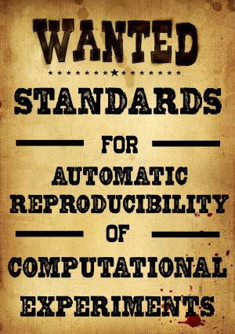

{.r-stretch}

[Samuel&nbsp;Grayson, Reed&nbsp;Milewicz, Joshua&nbsp;Teves, Daniel&nbsp;S.&nbsp;Katz, Darko&nbsp;Marinov]{style="font-size: 30px"}

# Problem: artifact evaluation

::: incremental
- Author has to write plain-English description
- Artifact evaluator (AE) tries to follow
- Author: You didn't follow the instructions exactly!
- AE: You're instructions were ambiguous/unclear.
- Future user: Author and AE got it to work. How exactly?
:::

# Problem: large scale re-execution studies

::: incremental
- [Repeatability in Computer Systems](https://dl.acm.org/doi/10.1145/2812803) by Collberg and Proebsting
  - Large manual effort &rarr; how many research codes still run?
- How do we reproduce the reproduction?
  - Instructions [here][1] are not machine-readable
- Authors: it would have worked; you just didn't invoke the right commands! [here][2]
:::

[1]: http://reproducibility.cs.arizona.edu/v2/data/tissec15_DannerDKL12_build.txt
[2]: http://reproducibility.cs.arizona.edu/v2/index.html#BarowyCBM12

# Insights

::: {.incremental style="font-size: 36px"}
- Everyone figures out how to reproduce by themselves
  - Correct documentation requires manual effort
  - Often absent, out-of-date, incomplete, or ambiguous
- Want a *machine-readable* way to *capture* and *share* reproducibility instructions
  - Authors &rarr; with AE, readers
  - Re-executors &rarr; other re-executors, readers
:::

# Insights

::: {.incremental style="font-size: 36px"}
- Instructions needed to reproduce = retrospective provenance
- Most important is commands/arguments
- Commands define software environment
  - Other approaches (CDE) too expensive (storage, perf)
- Imperfect data still better starting point
- This data is _automatically_ collectable
:::

# Benefits to authors

::: incremental
- "Pushbutton" artifact evaluation
- Automatic uncertainty quantification
- Regression tests/CI
:::

# Research opportunities

Makes research software studyable by software engineering researchers

::: incremental
- Automatic repair studies
- Reproducibility assessment
- Provenance overhead
- Performance impact
:::

# Example

```xml
<rdf:RDF>
  <process rdf:about="#make">
    <command>make all</command>
  </process>
  <process rdf:about="#run" depends-on="#make">
    <command>./simulate</command>
    <prov:generated>
      <doco:figure>
        <rdf:Description>
          <dc:title>Figure 2b</dc:title>
          <dc:isPartOf rdf:resource=
            "https://doi.org/10.1234/123456789" />
        </rdf:Description>
      </doco:figure>
    </prov:generated>
  </process>
</rdf:RDF>
```

# Specification requirements

::: incremental
- Not a workflow engine, but can invoke one
- Decentralized dataset
  - Store with code repo or third party repo
  - Can be uploaded by authors, users, or re-executors (not just authors!)
- Shell is lingua franca
  - Better semantics if we recognize shell command
- Should support optional data that is more complex to collect
  - Automatic: Files read/written (1-15% overhead)
  - Manual: Input/output types
  - Manual: Classify parameters as {calibration, fidelity}
  - Manual: Link to pub
:::

# Linkable ontologies and data providers

::: {.incremental style="font-size: 34px"}
- [wf4ever](https://wf4ever.github.io/ro/)
- [Nepomuk File Ontology (NFO)](https://oscaf.sourceforge.net/nfo.html)
- [Document Component Ontology (DoCO)](https://sparontologies.github.io/doco/current/doco.html)
- [Nanopublications](https://nanopub.net/guidelines/working_draft/)
- [Description Of A Project (DOAP)](https://github.com/ewilderj/doap)
- [Transitive Credit](https://arxiv.org/abs/1407.5117v3)/[CRediT](https://credit.niso.org/)
- [ORCID](https://orcid.org/)
- [Datacite Ontology](https://sparontologies.github.io/datacite/current/datacite.html)
:::

# Why not ___?

::: incremental
- Workflow engine
  - Which one? Support all?
- Docker/Nix/Guix
  - Not all experiments can be Dockerized or Nix-ified
  - What volume/flags?
  - Oriented more towards build-phase
- Scripts or CI
  - Could leverage!
  - Machine readable way to link script &rarr; linked data?
  - Easier to go the other way, linked data &rarr; scripts
:::

# Why not ___?

::: incremental
- CDE/SciUnit/ReproZip
  - Could leverage!
  - Too expensive, few users
- Sumatra
  - Could leverage!
  - Sharable data in interoperable form
:::

# Wanted: A community effort

::: incremental
- Interested stakeholders
  - Computational scientists
  - Research software engineers/researchers
  - Provenance researchers
- Exemplars
- <https://github.com/charmoniumQ/execution-description>
:::

<!--
Slide 1 (Title) 00:20
Slide 2 (Problem: AE): 01:04
Slide 3 (Problem: Re-ex): 03:40
Slide 4 (Insights): 04:36
Slide 5 (Insights II): 05:36
Slide 6 (Benefits to authors): 06:32
Slide 7 (Research opportunities): 08:40
Slide 8 (Code example): 09:30
Slide 10 (Reqs): 12:25
Slide 11 (Linkable to others): 14:00
Slide 12 (Other kinds of data): 
Slide 13 (Why not): 16:20
-->
